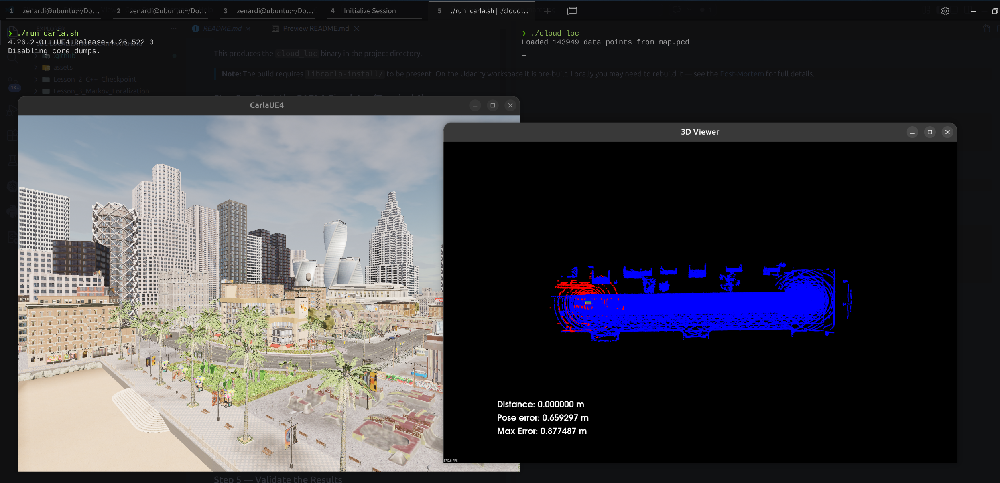

# Self-Driving Cars - Course 4: Localization - Exercices & Final Project

- [Self-Driving Cars - Course 4: Localization - Exercices \& Final Project](#self-driving-cars---course-4-localization---exercices--final-project)
  - [Dependencies](#dependencies)
- [Instructions](#instructions)
  - [Step 1: Fork and Clone the Repository](#step-1-fork-and-clone-the-repository)
  - [Step 2: Practice the Exercises or the Project](#step-2-practice-the-exercises-or-the-project)
    - [Lesson\_2\_C++\_Checkpoint Exercises](#lesson_2_c_checkpoint-exercises)
    - [Lesson\_3\_Markov\_Localization Exercises](#lesson_3_markov_localization-exercises)
    - [Lesson\_4\_Intro\_to\_PCL Exercises](#lesson_4_intro_to_pcl-exercises)
    - [Lesson\_5\_Creating\_Scan\_Matching\_Algorithms](#lesson_5_creating_scan_matching_algorithms)
    - [Lesson\_6\_Utilizing\_Scan\_Matching](#lesson_6_utilizing_scan_matching)
    - [Lesson\_7\_Project\_Scan\_Matching\_Localization](#lesson_7_project_scan_matching_localization)
      - [Folder Structure](#folder-structure)
      - [What is `libcarla-install/`?](#what-is-libcarla-install)
      - [What is `rpclib/`?](#what-is-rpclib)
  - [Building \& Running the Project (Lesson 7)](#building--running-the-project-lesson-7)
    - [Prerequisites](#prerequisites)
    - [Step 1 — Build](#step-1--build)
    - [Step 2 — Start the CARLA Simulator (Terminal 1)](#step-2--start-the-carla-simulator-terminal-1)
    - [Step 3 — Run the Localization Client (Terminal 2)](#step-3--run-the-localization-client-terminal-2)
    - [Step 4 — Drive the Car](#step-4--drive-the-car)
    - [Step 5 — Validate the Results](#step-5--validate-the-results)
  - [Testing the Implementation](#testing-the-implementation)
    - [Checkpoint 1 — Clean Build](#checkpoint-1--clean-build)
    - [Checkpoint 2 — CARLA Starts and Binds Port 2000](#checkpoint-2--carla-starts-and-binds-port-2000)
    - [Checkpoint 3 — cloud\_loc Connects and Spawns the Vehicle](#checkpoint-3--cloud_loc-connects-and-spawns-the-vehicle)
    - [Checkpoint 4 — Lidar Scans Are Being Processed (NDT Running)](#checkpoint-4--lidar-scans-are-being-processed-ndt-running)
    - [Checkpoint 5 — Localisation Accuracy Over Distance](#checkpoint-5--localisation-accuracy-over-distance)
    - [Checkpoint 6 — Final Pass/Fail Verdict](#checkpoint-6--final-passfail-verdict)
    - [Quick Sanity Test (no driving needed)](#quick-sanity-test-no-driving-needed)
  - [Troubleshooting](#troubleshooting)
    - [Issue 1 — Build fails: C++14 / PCL 1.15 incompatibility](#issue-1--build-fails-c14--pcl-115-incompatibility)
    - [Issue 2 — CARLA version mismatch (0.9.9.4 client vs 0.9.16 simulator)](#issue-2--carla-version-mismatch-0994-client-vs-0916-simulator)
    - [Issue 3 — `LidarMeasurement` API change between 0.9.9.x and 0.9.16](#issue-3--lidarmeasurement-api-change-between-099x-and-0916)
    - [Issue 4 — CARLA crashes immediately with `-opengl`](#issue-4--carla-crashes-immediately-with--opengl)
    - [Issue 5 — `SpawnActor` throws "Spawn failed because of collision"](#issue-5--spawnactor-throws-spawn-failed-because-of-collision)
    - [Issue 6 — SIGSEGV in UCX streaming on Ubuntu 25.10 (glibc 2.42)](#issue-6--sigsegv-in-ucx-streaming-on-ubuntu-2510-glibc-242)
    - [Issue 7 — Two `cloud_loc` binaries (cmake build dir vs project root)](#issue-7--two-cloud_loc-binaries-cmake-build-dir-vs-project-root)


## Dependencies
Before you practice the exercises in this repository, ensure that your development environment is configured with the following tools and dependencies:

- [CARLA simulator 0.9.9.4](https://github.com/carla-simulator/carla/releases/tag/0.9.9) 
- [NICE DCV Server](https://docs.aws.amazon.com/dcv/latest/adminguide/setting-up-installing-linux-prereq.html). This step will install Nvidia drivers along with CUDA libraries for the underlying Tesla T4 GPU
- C++ 
- Git
- [OpenCV](https://docs.opencv.org/4.x/d7/d9f/tutorial_linux_install.html)
- [CMake](https://askubuntu.com/questions/161104/how-do-i-install-make) and Make
- [VSCode](https://code.visualstudio.com/download), or a similar IDE
- [Eigen Library for C++](https://eigen.tuxfamily.org/index.php?title=Main_Page)
- [Point Cloud Library](https://pointclouds.org/downloads/)
- Python3 and Pip
- ROS


# Instructions

## Step 1: Fork and Clone the Repository
Fork the repository to your Github account and clone it to your local development environment using the following commands:

```bash
git clone https://github.com/udacity/nd0013_cd2693_Exercise_Starter_Code.git
cd nd0013_cd2693_Exercise_Starter_Code
```

Next, select the lesson you want to practice. The sections below outline the lesson-specific instructions.

## Step 2: Practice the Exercises or the Project
<br />

### Lesson_2_C++_Checkpoint Exercises

Navigate to the individual challenge sub-directory containing the **main.cpp** file. For example, change to the **challenge1/** solution directory.

```bash
cd Lesson_2_C++_Checkpoint/solutions/solution1/
```

Update the **main.cpp** file where needed, and execute the following commands.

```bash
g++ main.cpp
./a.out
```

<br /><br />

### Lesson_3_Markov_Localization Exercises

Change to the specific exercise directory, compile the **main.cpp** file, and execute the **a.out**. For example, the command below will help you run the  **1-initialize-priors-function** exercise solution. 

```bash
cd Lesson_3_Markov_Localization/markov/1-initialize-priors-function
```

Refer to the **Guide-[exercise-name].ipynb** for the specific instructions on how to update the **main.cpp** file. If you need help, you can compare your edits with the provided solution.

```bash
cd solution
g++ main.cpp  
./a.out
```

<br /><br />

### Lesson_4_Intro_to_PCL Exercises

Refer to the exercise starter files in the [](https://github.com/udacity/SFND_Lidar_Obstacle_Detection) repository. 

```bash
cd Documents
git clone https://github.com/udacity/SFND_Lidar_Obstacle_Detection.git
cd SFND_Lidar_Obstacle_Detection
```

Here is the file structure in the Github repository linked above.

```bash
.
├── CMakeLists.txt
├── CODEOWNERS
├── README.md
├── media
│   └── ObstacleDetectionFPS.gif
└── src
    ├── environment.cpp
    ├── processPointClouds.cpp
    ├── processPointClouds.h
    ├── quiz
    │   ├── cluster
    │   └── ransac
    ├── render
    │   ├── box.h
    │   ├── render.cpp
    │   └── render.h
    └── sensors
        ├── data
        └── lidar.h
```
Refer the [README.md](https://github.com/udacity/SFND_Lidar_Obstacle_Detection#readme) for specific instructions. 

<br /><br />

### Lesson_5_Creating_Scan_Matching_Algorithms

```bash
cd Lesson_5_Creating_Scan_Matching_Algorithms
```

This lesson has the following exercises. 

```bash
.
├── Exercise-Intro-to-ICP
├── Exercise-Creating-ICP
└── Exercise-Creating-NDT
```

The specific commands for each exercise are available in the respective sub-directory. Follow the instructions per the respective README files.

|Exercise|README|
|---------|---------|
|Exercise-Intro-to-ICP|[README](/Lesson_5_Creating_Scan_Matching_Algorithms/Exercise-Intro-to-ICP/README.md)|
|Exercise-Creating-ICP|[README](/Lesson_5_Creating_Scan_Matching_Algorithms/Exercise-Creating-ICP/README.md)|
|Exercise-Creating-NDT|[README](/Lesson_5_Creating_Scan_Matching_Algorithms/Exercise-Creating-NDT/README.md)|


<br /><br />

### Lesson_6_Utilizing_Scan_Matching

```bash
cd Lesson_6_Utilizing_Scan_Matching
```

This lesson has the following exercises.

```bash
.
├── Exercise-ICP-Alignment
├── Exercise-Mapping
└── Exercise-NDT-Alignment
```

The specific command for each exercise in available in the respective sub-directory. Follow the instructions per the respective README files.

|Exercise|README|
|---------|---------|
|Exercise-ICP-Alignment|[README](/Lesson_6_Utilizing_Scan_Matching/Exercise-ICP-Alignment/README.md)|
|Exercise-NDT-Alignment|[README](/Lesson_6_Utilizing_Scan_Matching/Exercise-NDT-Alignment/README.md)|
|Exercise-Mapping|[README](/Lesson_6_Utilizing_Scan_Matching/Exercise-Mapping/README.md)|


<br /><br />

<br /><br />

### Lesson_7_Project_Scan_Matching_Localization



#### Folder Structure

```
Lesson_7_Project_Scan_Matching_Localization/
│
├── CARLA/                        ← CARLA 0.9.16 simulator (pre-bundled)
│   ├── CarlaUE4.sh               ← simulator launch script
│   ├── CarlaUE4/                 ← UE4 binary and assets
│   ├── PythonAPI/                ← Python client wheel
│   └── ...
│
├── AdditionalMaps/               ← extra CARLA map packs
│
├── c3-project/                   ← project source code (work here)
│   ├── c3-main.cpp               ← ★ student implementation file
│   ├── CMakeLists.txt            ← build configuration
│   ├── helper.cpp / helper.h     ← rendering and geometry helpers
│   ├── map.pcd                   ← pre-recorded LiDAR map of Town10HD
│   ├── map_loop.pcd              ← alternative looped map
│   ├── libcarla-install/         ← CARLA C++ client library + headers
│   ├── rpclib/                   ← RPC library (bundled)
│   ├── run_carla.sh              ← launches CARLA (Terminal 1)
│   ├── run_cloud_loc.sh          ← launches localization client (Terminal 2)
│   └── cloud_loc                 ← compiled binary (generated by cmake)
│
├── course-content/               ← lesson notes and project instructions
│
└── POSTMORTEM.md                 ← setup troubleshooting deep-dive
```

> [!TIP] 
> **Key relationship:** `run_carla.sh` inside `c3-project/` points to `../CARLA/CarlaUE4.sh` — so **both `CARLA/` and `c3-project/` must sit side by side** under `Lesson_7_Project_Scan_Matching_Localization/` for the scripts to work.

#### What is `libcarla-install/`?

`libcarla-install/` is the **CARLA C++ client SDK** — the bridge that lets `c3-main.cpp` communicate with the running CARLA simulator. It has two sub-folders:

```
libcarla-install/
├── include/                  ← C++ headers your code #includes
│   ├── carla/                ← CARLA API: Client, World, Vehicle, Sensor, LiDAR...
│   ├── rpc/                  ← RPC communication layer (msgpack)
│   └── recast/               ← Navigation mesh headers
│
└── lib/                      ← Static libraries linked at build time
    ├── libcarla_client.a     ← main CARLA client (6.3 MB)
    ├── librpc.a              ← RPC/msgpack protocol (1.2 MB)
    ├── libboost_filesystem.a ← Boost dependencies
    ├── libboost_system.a
    ├── libboost_program_options.a
    └── libDebugUtils/Detour/Recast.a  ← navigation stubs
```

When `c3-main.cpp` calls `client.GetWorld()`, registers a lidar callback, or spawns a vehicle, those calls are serialised by `libcarla_client.a` and sent over TCP to the CARLA simulator on port 2000.

> [!WARNING] 
> **On the Udacity submission workspace** this folder comes pre-built and correct — you do not need to touch it.
>
> **Locally (this repo):** the Git LFS originally contained the build for CARLA **0.9.9.4**, but the bundled simulator is **0.9.16**. This mismatch caused an immediate **segfault**. The `libcarla_client.a` here has been rebuilt from CARLA 0.9.16 source. Full details in [POSTMORTEM.md](POSTMORTEM.md).

#### What is `rpclib/`?

`rpclib` is an open-source C++ **Remote Procedure Call (RPC) library** (v2.2.1, MIT license) that CARLA uses as the wire protocol between the simulator and the C++ client. It is bundled as full source code so the project can compile it in-tree.

```
rpclib/
├── include/rpc/          ← Headers: client.h, server.h, msgpack.hpp, ...
├── lib/rpc/              ← Source: client.cc, server.cc, dispatcher.cc, ...
├── tests/                ← Library's own test suite (not related to the project)
└── CMakeLists.txt        ← Built automatically as part of the project build
```

**How it fits in the stack:**

```
c3-main.cpp
    └── #include <carla/client/...>   (libcarla-install/include)
            └── libcarla_client.a     (libcarla-install/lib)
                    └── rpclib        (serialises calls with msgpack over TCP)
                            └── CARLA simulator :2000
```

In short: your code calls the CARLA C++ API → `libcarla` serialises the call using `rpclib` + msgpack → sends it over TCP to the simulator. `rpclib` is the lowest-level transport layer. You never interact with it directly.

Navigate to the project source directory:

```bash
cd Lesson_7_Project_Scan_Matching_Localization/c3-project
```

---

## Building & Running the Project (Lesson 7)

### Prerequisites

| Dependency | Version tested |
|---|---|
| Ubuntu | 22.04 LTS (Udacity workspace) · 25.10 (local, see Troubleshooting) |
| CARLA Simulator | 0.9.16 (bundled in `../CARLA/`) |
| PCL | ≥ 1.2 (system package) |
| CMake | ≥ 3.10 |
| GCC | ≥ 9 (C++17 required) |

### Step 1 — Build

```bash
cd Lesson_7_Project_Scan_Matching_Localization/c3-project
cmake -S . -B build -DCMAKE_BUILD_TYPE=Release
cmake --build build -j$(nproc)
```

This produces the `cloud_loc` binary in the project directory.

> **Note:** The build requires `libcarla-install/` to be present. On the Udacity workspace it is pre-built. Locally you may need to rebuild it — see the [Post-Mortem](Lesson_7_Project_Scan_Matching_Localization/POSTMORTEM.md) for full details.

### Step 2 — Start the CARLA Simulator (Terminal 1)

```bash
cd Lesson_7_Project_Scan_Matching_Localization/c3-project
./run_carla.sh
```

Wait until the CARLA city window appears and is fully loaded (~15 s).

> On Ubuntu 25.10 with an NVIDIA GPU the script already includes the required PRIME and Vulkan environment variables. See [Troubleshooting](#troubleshooting) if CARLA crashes.

### Step 3 — Run the Localization Client (Terminal 2)

```bash
cd Lesson_7_Project_Scan_Matching_Localization/c3-project
./run_cloud_loc.sh    # preferred — sets required env vars
# or directly:
./cloud_loc
```

A **"3D Viewer"** window opens showing the blue map point cloud and the spawned vehicle.

### Step 4 — Drive the Car

Click on the **3D Viewer** window to give it keyboard focus, then use:

| Key | Action |
|---|---|
| ↑ Up arrow | Accelerate |
| ↓ Down arrow | Brake / reverse |
| ← Left arrow | Steer left |
| → Right arrow | Steer right |
| `a` | Re-centre top-down camera view |

### Step 5 — Validate the Results

The 3D Viewer overlays real-time metrics:

| Metric | Requirement | Pass? |
|---|---|---|
| **Distance** | ≥ 170 m | Keep driving until the counter reaches 170 |
| **Max Error** | < 1.2 m | Must never exceed 1.2 m during the run |
| **Pose Error** | live reading | Shows current localisation error vs. ground truth |

When `Distance ≥ 170 m` the simulator evaluates automatically:
- 🟢 **"Passed!"** (green text) — ready to submit
- 🔴 **"Try Again"** (red text) — max pose error exceeded 1.2 m; restart and drive again

---

## Testing the Implementation

This section walks through every checkpoint you should verify when running the project for the first time. Each checkpoint has an **expected result** so you know immediately if something is wrong before driving the full 170 m.

### Checkpoint 1 — Clean Build

```bash
cd Lesson_7_Project_Scan_Matching_Localization/c3-project
cmake -S . -B build -DCMAKE_BUILD_TYPE=Release 2>&1 | tail -4
cmake --build build -j$(nproc) 2>&1 | tail -4
```

**✅ Expected:**
```
-- Configuring done
-- Generating done
-- Build files have been written to: .../c3-project/build
[100%] Built target cloud_loc
```
**✅ Expected:** `cloud_loc` binary present in the project directory:
```bash
ls -lh cloud_loc
# -rwxrwxr-x ... 3.2M ... cloud_loc
```
**❌ If you see** `error: 'index_sequence' is not a member of 'std'` — your compiler is using C++14. Verify `CMakeLists.txt` contains `set(CMAKE_CXX_STANDARD 17)`.

---

### Checkpoint 2 — CARLA Starts and Binds Port 2000

Open a terminal and run:
```bash
cd Lesson_7_Project_Scan_Matching_Localization/c3-project
./run_carla.sh
```
Wait ~15 seconds, then in a **second terminal** verify:
```bash
ss -tlnp | grep 2000
```

**✅ Expected:**
```
LISTEN 0  128  0.0.0.0:2000  0.0.0.0:*  users:(("CarlaUE4-Linux-",pid=...,fd=...))
```
A CARLA city window (Town10HD_Opt) is visible on your display.

**❌ If CARLA crashes on start** — check it is using Vulkan, not OpenGL. `run_carla.sh` already includes `-vulkan`. See [Troubleshooting > Issue 4](#issue-4--carla-crashes-on--opengl-nvidia-prime).

---

### Checkpoint 3 — cloud_loc Connects and Spawns the Vehicle

With CARLA running, in a second terminal:
```bash
cd Lesson_7_Project_Scan_Matching_Localization/c3-project
./run_cloud_loc.sh
```

**✅ Expected console output** (within ~10 s):
```
Loaded 143949 data points from map.pcd
```

**✅ Expected on screen:**
- A **"3D Viewer"** window opens
- The city map is rendered as a **blue point cloud**
- A small **green box** (NDT pose estimate) and a **red box** (ground-truth pose) appear at the spawn point — they should overlap closely at rest

**❌ If you see** `Spawn failed because of collision at spawn position` — a stale vehicle is occupying all spawn points. Restart CARLA (close the CARLA window and re-run `run_carla.sh`) and retry. See [Troubleshooting > Issue 5](#issue-5--spawnactor-throws-spawn-failed-because-of-collision).

**❌ If cloud_loc crashes with `Segmentation fault` in `libucs.so`** — UCX shared-memory transport is failing. Use `run_cloud_loc.sh` (which sets `UCX_TLS=tcp`) instead of running `./cloud_loc` directly. See [Troubleshooting > Issue 6](#issue-6--sigsegv-in-ucx-shared-memory-transport-ubuntu-2510).

---

### Checkpoint 4 — Lidar Scans Are Being Processed (NDT Running)

After the 3D Viewer opens, click the window to give it focus and press **↑ (Up arrow)** once to give the car a small throttle.

**✅ Expected within 2–3 seconds:**
- A **red point cloud** (the current lidar scan, transformed into world frame) appears overlaid on the map
- The text overlay in the top-left of the viewer updates:
  ```
  Max Error:  0.XXX m
  Pose error: 0.XXX m
  Distance:   0.XXX m
  ```
- The green box (NDT estimate) moves with the car and stays close to the red box (ground truth)

**❌ If the red scan cloud never appears** — the lidar callback is not firing. Check the CARLA terminal for errors. Try restarting both CARLA and cloud_loc.

**❌ If the green box drifts immediately far from the red box** — NDT is diverging. This can happen if the car spawns in an area the map doesn't cover well. Restart and let it settle before accelerating.

---

### Checkpoint 5 — Localisation Accuracy Over Distance

Drive the car continuously using arrow keys. Monitor the 3D Viewer text overlay:

| What to watch | Good sign | Bad sign |
|---|---|---|
| **Pose error** | Fluctuates 0.1–0.6 m on straight roads | Jumps above 1.0 m repeatedly |
| **Max Error** | Stays well below 1.2 m | Climbs toward 1.2 m |
| **Green box** | Tracks the red box closely | Drifts away from the red box |
| **Red scan cloud** | Updates every ~1 s, aligned with map | Looks shifted / misaligned |

**Tips for staying under 1.2 m error:**
- Drive **smoothly** — avoid sharp U-turns or high-speed spins
- Press **`a`** to re-centre the camera if you lose sight of the vehicle
- If the green and red boxes diverge significantly, **slow down** — NDT needs a few scans to re-converge

---

### Checkpoint 6 — Final Pass/Fail Verdict

Once the `Distance` counter reaches **170 m**, the viewer displays the verdict automatically:

**✅ PASS:**
```
Passed!                    ← green text, top of viewer
Max Error: X.XXX m         ← must be < 1.2 m
Distance:  170.XXX m
```

**❌ FAIL:**
```
Try Again                  ← red text
Max Error: X.XXX m         ← exceeded 1.2 m at some point
```
If you get "Try Again", restart `cloud_loc` (CARLA can keep running) and drive more carefully.

---

### Quick Sanity Test (no driving needed)

To verify the pipeline is wired up correctly without driving 170 m, run cloud_loc and just let the car sit idle for ~30 seconds:

```bash
./run_cloud_loc.sh
```

After the 3D Viewer opens:
- The **blue map** should be fully rendered
- A **red scan cloud** should appear within ~5 seconds (lidar spinning even at rest)
- `Pose error` should read near **0.000 m** (car is stationary, NDT converges to exact position)
- `Max Error` should remain **< 0.1 m** at rest
- Both CARLA and cloud_loc processes should still be alive after 60 seconds (`ps aux | grep -E "CarlaUE4|cloud_loc"`)

If all of the above hold, the implementation is correct and ready for the full 170 m validation run.

---

## Troubleshooting

The following issues were encountered running the Udacity starter code on a **local Ubuntu 25.10 + NVIDIA RTX 5070** machine. The fixes are already applied in this repository. For root-cause details and the full investigation see the [Post-Mortem document](Lesson_7_Project_Scan_Matching_Localization/POSTMORTEM.md).

### Issue 1 — Build fails: C++14 / PCL 1.15 incompatibility

**Symptom:**
```
error: 'index_sequence' is not a member of 'std'
```
**Cause:** PCL 1.12+ requires C++17; the original `CMakeLists.txt` set `CMAKE_CXX_STANDARD 14`.  
**Fix applied:** `CMakeLists.txt` updated to `set(CMAKE_CXX_STANDARD 17)`.

---

### Issue 2 — CARLA version mismatch (0.9.9.4 client vs 0.9.16 simulator)

**Symptom:**
```
WARNING: Version mismatch detected: Client API 0.9.9.4 vs Simulator 0.9.16
[Segmentation fault / core dumped]
```
**Cause:** `libcarla-install/lib/libcarla_client.a` in Git LFS was built for CARLA 0.9.9.4; the bundled simulator is 0.9.16. The two are binary-incompatible (different RPC serialisation protocol).  
**Fix applied:** Rebuilt `libcarla_client.a` from CARLA 0.9.16 source. See the Post-Mortem for all patches required.

---

### Issue 3 — `LidarMeasurement` API change between 0.9.9.x and 0.9.16

**Symptom:** Compile error or wrong lidar values (all zeros).  
**Cause:** In CARLA ≤ 0.9.9.x the detection point fields were direct members (`detection.x`, `.y`, `.z`). In 0.9.16 they moved to a nested struct (`detection.point.x`, `.point.y`, `.point.z`).  
**Fix applied:** Updated the lidar callback in `c3-main.cpp`:
```cpp
// CARLA 0.9.16:
float dx = detection.point.x, dy = detection.point.y, dz = detection.point.z;
```
> **Udacity workspace note:** The grader uses CARLA 0.9.9.4. If submission grading fails, revert to `detection.x / .y / .z`.

---

### Issue 4 — CARLA crashes immediately with `-opengl`

**Symptom:**
```
Signal 11 (double RequestExitWithStatus)
```
immediately on launch when using `-opengl`.  
**Cause:** NVIDIA PRIME on-demand switching defaults the OpenGL stack to Intel Mesa. CARLA's UE4 OpenGL renderer cannot initialise on a software-only GL context.  
**Fix applied:** Switch to Vulkan and add PRIME offload variables in `run_carla.sh`:
```bash
__NV_PRIME_RENDER_OFFLOAD=1 \
__GLX_VENDOR_LIBRARY_NAME=nvidia \
VK_ICD_FILENAMES=/usr/share/vulkan/icd.d/nvidia_icd.json \
./CarlaUE4.sh -vulkan -quality-level=Low -nosound
```

---

### Issue 5 — `SpawnActor` throws "Spawn failed because of collision"

**Symptom:**
```
terminate called after throwing an instance of 'std::runtime_error'
  what():  Spawn failed because of collision at spawn position
```
**Cause:** If a previous `cloud_loc` session crashed without cleanly destroying the ego vehicle, the spawn point remains occupied in the running CARLA world.  
**Fix applied:** Replaced the single `world.SpawnActor(...)` call with a loop over all 155 available spawn points using the non-throwing `TrySpawnActor`:
```cpp
for (size_t sp = 0; sp < spawnPoints.size() && !ego_actor; ++sp)
    ego_actor = world.TrySpawnActor((*vehicles)[12], spawnPoints[sp]);
```

---

### Issue 6 — SIGSEGV in UCX streaming on Ubuntu 25.10 (glibc 2.42)

**Symptom:**
```
Caught signal 11 (Segmentation fault: invalid permissions for mapped object)
==== backtrace ====
 0  /lib/x86_64-linux-gnu/libucs.so.0(ucs_handle_error+...)
```
crash ~57 seconds after startup, triggered on first lidar scan delivery.  
**Cause:** CARLA 0.9.16 uses OpenUCX for high-bandwidth sensor streaming. UCX's shared-memory transport (`posix`/`cma`) uses `mmap()` with memory-protection flags that Ubuntu 25.10's kernel (6.11+) with glibc 2.42 rejects under stricter `vm.mmap_min_addr` / SELinux-style memory policies.  
**Fix applied:** Force UCX to use TCP transport (slightly higher latency, but fully stable):
```bash
UCX_TLS=tcp UCX_POSIX_USE_PROC_LINK=n ./cloud_loc
```
This is wrapped in `run_cloud_loc.sh` and already set in `run_carla.sh`.

---

### Issue 7 — Two `cloud_loc` binaries (cmake build dir vs project root)

**Symptom:** Code changes don't take effect; binary in project root is stale.  
**Cause:** `cmake .` (old style) places the binary in the project root; `cmake -S . -B build` places it in `build/`. The project root binary was left from a previous build and was being run instead of the new one.  
**Fix applied:** Added to `CMakeLists.txt`:
```cmake
set_target_properties(cloud_loc PROPERTIES RUNTIME_OUTPUT_DIRECTORY ${CMAKE_SOURCE_DIR})
```
The binary now always lands in the project root after any cmake build invocation.
